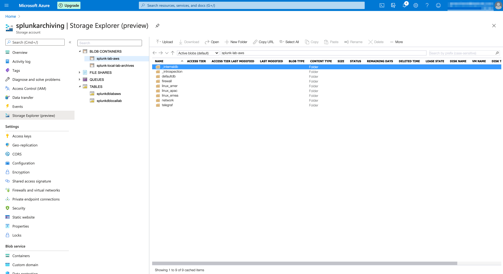
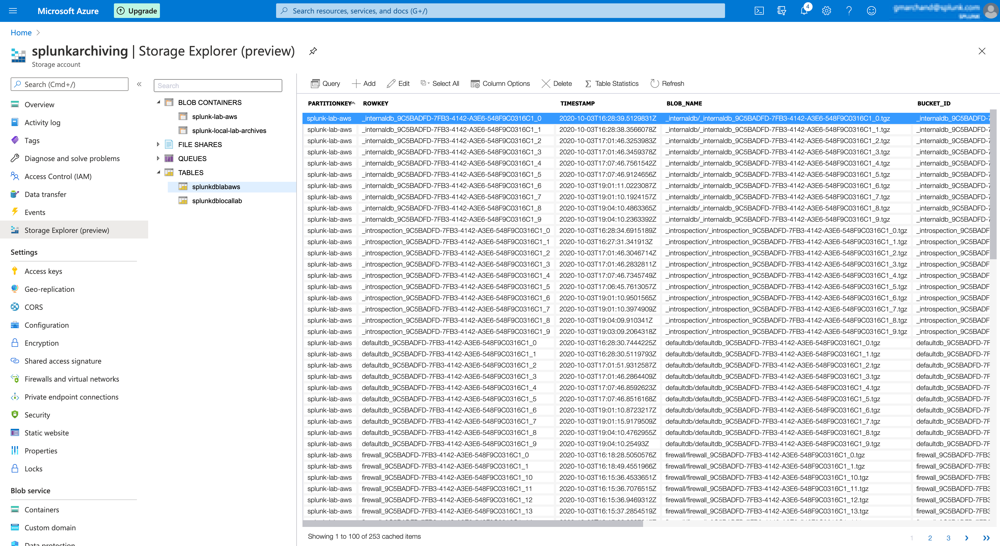

# Cold to Frozen framework for Splunk to archive buckets in Azure blob storage

## Introduction

**This Add-on provides a robust and smart achiving framefork solution for Splunk Enterprise and Azure blob storage.**

It relies on the Splunk built-in archiving capabilities and Azure blob storage and tables via the usage of the Python SDK for Azure:

*Splunk Documentation links:*

- https://docs.splunk.com/Documentation/Splunk/latest/Indexer/Automatearchiving
- https://docs.splunk.com/Documentation/Splunk/latest/Indexer/Setaretirementandarchivingpolicy

*Azure links:*

- https://azure.github.io/azure-sdk/releases/latest/python.html
- https://docs.microsoft.com/en-us/python/api/?view=azure-python
- https://docs.microsoft.com/en-us/azure/storage/blobs/storage-quickstart-blobs-portal

**The framework and concept can be summarised the following way:**

- Splunk automatically calls the AzFrozen2Blob.py Python script when a bucket is frozen from cold storage (assuming archiving is enabled on the index)
- The Python script accesses an Azure storage account and verifies in a pre-defined Azure storage table if that bucket ID has been archived already (management of buckets replication for Splunk indexers in cluster)
- If the bucket has not been archived yet, a tgz archive of the bucket is created and uploaded to the pre-defined container in Azure blob
- If the upload to blob is successful, the Python script inserts a new record in the Azure storage table with all the useful information related to this bucket
- If the upload is successful, the script exists with an error code=0 which instructs Splunk that the bucket can be frozen, otherwise the script exit=1 and a new attempt will be made automatically by Splunk

**Analytic, management and reporting:**

Use the Splunk Add-on for Microsoft Cloud Services to monitor and index automatically records created in the Azure storage table:

- https://splunkbase.splunk.com/app/3110/
- https://docs.splunk.com/Documentation/AddOns/released/MSCloudServices/Configureinputs4

This application provides a dashboard and logic based on a KVstore collection that is automatically feed by the records indexed, which allows you to the power of Splunk language to review buckets that were achived, search for any information based on the rich information stored in the Azure table, or provide analytic reporting.





## Dependencies

Every indexer needs to have a Python 3 interpreter available, and as well the following Azure SDK Python installed:

``
pip install azure-storage-blob
``

``
pip install azure-cosmosdb-table
``

*See:*

- https://pypi.org/project/azure-storage-blob/
- https://pypi.org/project/azure-cosmosdb-table/

These dependencies should be installed in the name space of the Splunk user owning the Splunk processes (splunk usually on Linux) which pip allows you to, which in turn allows Splunk to use the OS level Python interpreter (/usr/bin/python) and benefit from the Python SDK librairies for Azure.

## Howto:

1. Create a storage account in Azure if you do not have one yet

2. Collect the required information, you need to know the Azure blob connection URL and the connection string

2. Create a local directory in the application root directory

5. Copy the default/azure2blob.conf to local/

6. Edit local/azure2blob.conf and configure

7. Copy or move your package to the cluster master ($SPLUNK_HOME/etc/master-apps) and publish the cluster-bundle

8. Finally edit your indexes.conf to enable the cold2frozen framework, example:

```
[firewall_emea]
coldToFrozenScript = "/usr/bin/python3" "$SPLUNK_HOME/etc/slave-apps/TA-azure-blob-cold2frozen/bin/AzFrozen2Blob.py"
```

# Get data

https://docs.splunk.com/Documentation/AddOns/released/MSCloudServices/Configureinputs4