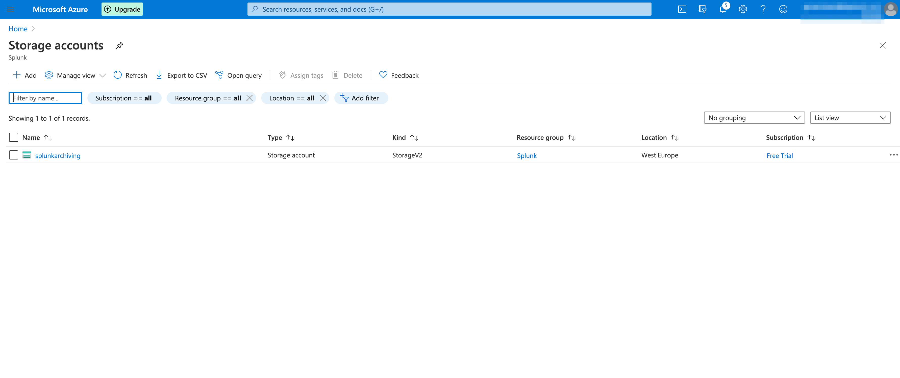
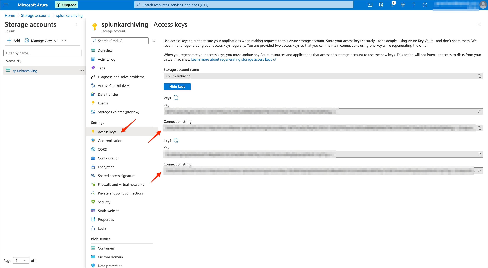
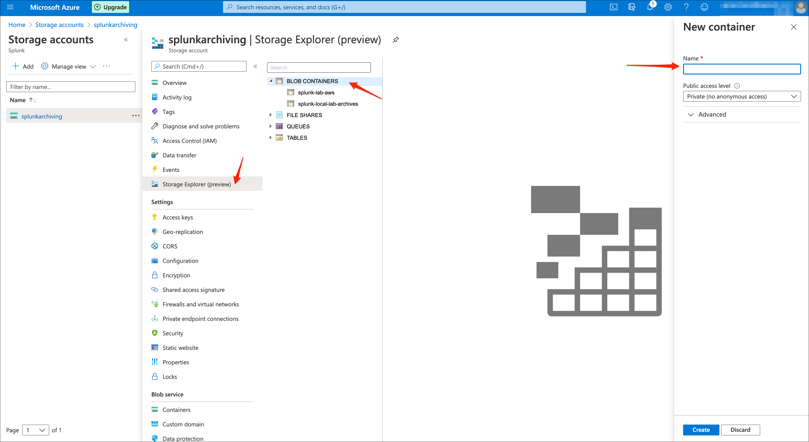
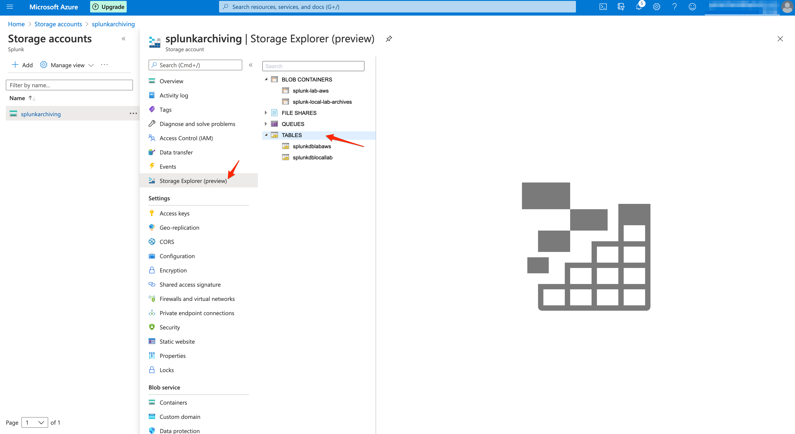
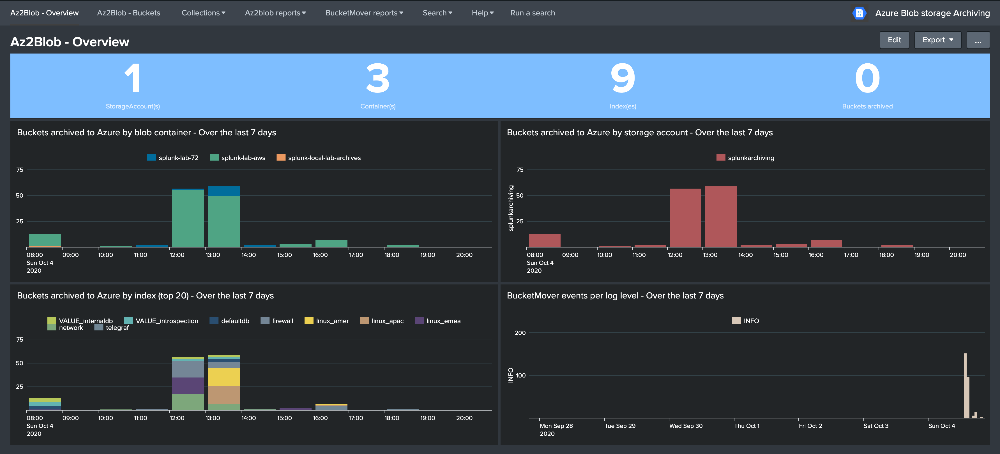
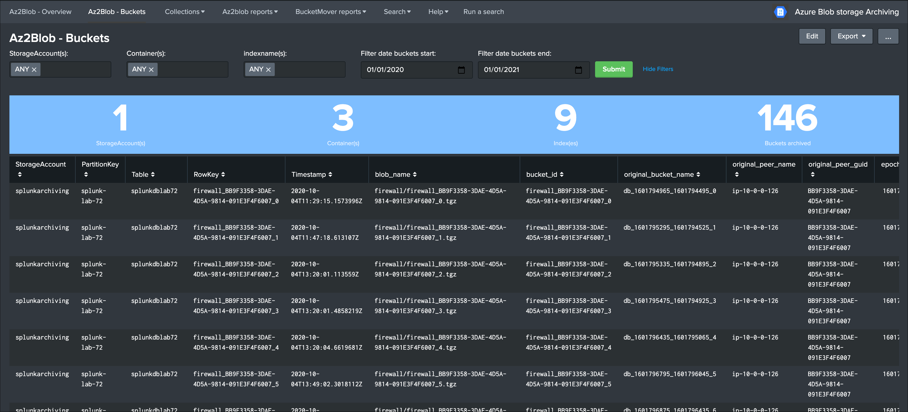

Configuration
=============

Azure storage account Configuration
-----------------------------------

**The first thing required is to have a storage account configured in Azure which will be used for the Splunk archiving blob storage and tables.**

*Follow the Azure documentation if you do not have a storage account yet:*

- https://docs.microsoft.com/en-us/azure/storage/common/storage-account-create?tabs=azure-portal

Azure storage account connection string
---------------------------------------

**Once you have a storage account, the next things you need to retrieve are the following information to configure the Add-on:**

**You need to know the connection string for your user account, this information will be stored on the indexers in the configuration file local/azure2blob.conf:**

::

    AZ_BLOB_CONNECTION_STRING = connection_string_to_the_blob_storage

**The connection string provides all the information required for the access to Azure blob storage and tables via the SDKs, you can find your connection string in Settings / Access keys in the Azure storage account portal:**

You can use any of the two connection strings provided by Azure, store this value as you will configure it in the local/azure2blob.conf file.

Azure storage blob container
----------------------------

**Decide what the container name will be to store the buckets archived from Splunk indexers, by default the container will be:**

::

    AZ_BLOB_CONTAINER = splunk-cold2frozen-archives

You can change this value to anything that suits your needs, if you have multiple environments to be archived in the same storage account, you likely will want to change this value to include the name of the environment.

Finally, it is ``recommended`` that you create the container manually in the Azure portal, however if you do not the Python backend will attempt to ``create it automatically``.

*Note: This name may only contain lowercase letters, numbers, and hyphens, and must begin with a letter or a number. Each hyphen must be preceded and followed by a non-hyphen character. The name must also be between 3 and 63 characters long.*

Azure storage table
-------------------

**Decide what the Azure storage table name will be, by default the table name will be:**

::

    AZ_STORAGE_TABLE_NAME = splunkdb

You can change this value to anything that suits your needs, if you have multiple environments to be archived in the same storage account, you likely will want to change this value to include the name of the environment.

Finally, it is ``recommended`` that you create the table manually in the Azure portal, however if you do not the Python backend will attempt to ``create it automatically``.

*Note: able names must be alphanumeric, cannot begin with a number, and must be between 3 and 63 characters long.*

Splunk indexer(s) configuration
-------------------------------

**Now that you have all information required, configure the Add-on local configuration, for instance when running in indexer clusters you have:**

::

    cd /opt/splunk/etc/master-apps
    ls -ltrd TA-azure-blob-archiving

**Create a local directory and copy default/azure2blob.conf:**

::

    mkdir TA-azure-blob-archiving/local
    cp -p TA-azure-blob-archiving/default/azure2blob.conf TA-azure-blob-archiving/local/

**Edit the file TA-azure-blob-archiving/local/azure2blob.conf and update the values according to your account and settings:**

::

    [azure2blob]
    AZ_BLOB_CONTAINER = splunk-cold2frozen-archives
    AZ_BLOB_CONNECTION_STRING = connection_string_to_the_blob_storage
    AZ_STORAGE_TABLE_NAME = splunkdb

**Finally, publish the cluster bundle, once the bundle is pushed the indexers are ready to start archiving to Azure blob storage.**

See :ref:`Manually testing archiving a bucket` to verify that your configuration is successful.

Splunk indexe(s) configuration to enable archiving
--------------------------------------------------

**To enable Azure blob archiving, you need to configure your indexes.conf to include the coldToFrozenScript parameter:**

*For Splunk version prior to 8.0, it is mandatory to use the shell wrapper to avoid Python import troubles:*

*Example:*

::

    [firewall_emea]
    coldToFrozenScript = "$SPLUNK_HOME/etc/slave-apps/TA-azure-blob-archiving/bin/AzFrozen2Blob.sh"

*Splunk instances starting 8.0 can directly call the Python backend:*

::

    [firewall_emea]
    coldToFrozenScript = "/usr/bin/python3" "$SPLUNK_HOME/etc/slave-apps/TA-azure-blob-archiving/bin/AzFrozen2Blob.py"

*Notes:*

- If the system level Python3 interpreter is not available in ``/usr/bin/python3``, you can either change this location or create a symbolic link as a best practice
- If you cannot define the symbolic link to ``/usr/bin/python3`` and you are running a Splunk version prior to Splunk 8.0, you will need to update the Python path in ``AzFrozen2Blob.sh`` (CAUTION: this is not upgrade resilient! A much better practice is to fix the OS)
- If you are configuring a standalone indexer rather indexers in clusters, change ``slave-apps`` to ``apps``
- Repeat this operation for every index where archiving needs to be enabled

Splunk Search Head(s) configuration
-----------------------------------

**The Add-on relies on the Splunk Add-on for Microsoft Cloud Services to provide insight on the archiving of buckets in Splunk.**

*Make sure the Add-on was installed and configured (register the storage account):*

- https://splunkbase.splunk.com/app/3110/

*Then enable indexing the storage table in Splunk:*

- https://docs.splunk.com/Documentation/AddOns/released/MSCloudServices/Configureinputs4

**The Add-on used the following macro to define access to the Azure storage table data indexed in Splunk:**

::

    [az2blob_archive_root_search]
    definition = index=* sourcetype="mscs:storage:table" source="*splunkdb*"
    iseval = 0

Update this macro to match the index(es) where you are indexing the table data, and update the source constraint if it does not match your table naming convention.

**Once you have started to index the Azure storage data, and if there has been buckets archived already, the UI will automatically expose the archives buckets information:**

