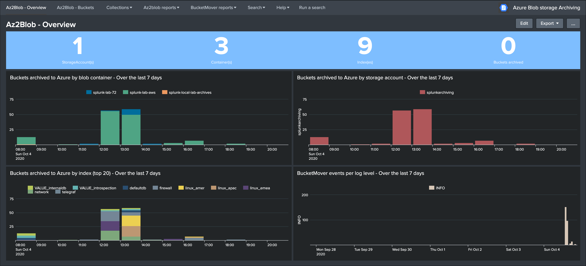

.. TA-azure-blob-archiving documentation master file, created by
   sphinx-quickstart on Tue Sep 18 23:25:46 2018.
   You can adapt this file completely to your liking, but it should at least
   contain the root `toctree` directive.

Welcome to the Splunk Add-on for Azure blob storage archiving application documentation
=======================================================================================

**This Add-on provides a robust and smart archiving framefork solution for Splunk Enterprise and Azure blob storage.**

It relies on the Splunk built-in archiving capabilities and Azure blob storage and tables via the usage of the Python SDK for Azure:

*Splunk Documentation links:*

- https://docs.splunk.com/Documentation/Splunk/latest/Indexer/Automatearchiving
- https://docs.splunk.com/Documentation/Splunk/latest/Indexer/Setaretirementandarchivingpolicy

*Azure links:*

- https://azure.github.io/azure-sdk/releases/latest/python.html
- https://docs.microsoft.com/en-us/python/api/?view=azure-python
- https://docs.microsoft.com/en-us/azure/storage/blobs/storage-quickstart-blobs-portal

.. image:: img/az_screen.png
   :alt: az_screen.png
   :align: center

.. image:: img/az_screen2.png
   :alt: az_screen2.png
   :align: center

.. image:: img/splunk_ui_main2.png
   :alt: splunk_ui_main2.png
   :align: center

**The framework and concept can be summarised the following way:**

- Splunk automatically calls the AzFrozen2Blob.py Python script when a bucket is frozen from cold storage (assuming archiving is enabled on the index)
- The Python script accesses an Azure storage account and verifies in a pre-defined Azure storage table if that bucket ID has been archived already (management of buckets replication for Splunk indexers in cluster)
- If the bucket has not been archived yet, a tgz archive of the bucket is created and uploaded to the pre-defined container in Azure blob
- If the upload to blob is successful, the Python script inserts a new record in the Azure storage table with all the useful information related to this bucket
- If the upload is successful, the script exists with an error code=0 which instructs Splunk that the bucket can be frozen, otherwise the script exit=1 and a new attempt will be made automatically by Splunk

Overview:
=========

.. toctree::
   :maxdepth: 2

   about
   compatibility
   support
   download

Deployment and configuration:
=============================

.. toctree::
   :maxdepth: 2

   deployment
   configuration
   tools

Troubleshoot:
=============

.. toctree::
   :maxdepth: 1

   troubleshoot

Versions and build history:
===========================

.. toctree::
   :maxdepth: 1

   releasenotes.rst
